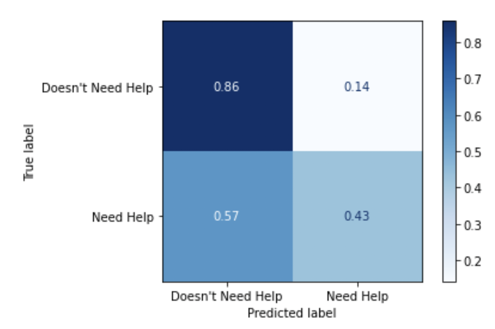

# PhD Student Mental Health Project


## Project Overview
This notebook contains analysis of survey data conducted by Shift Learning on PhD students. The project uses multiple machine learning models such as logistic regression, decision trees, naive bayes and catboost to draw insights into what risk factors contribute to mental health problems in PhD students and make recommendations on how to improve.

## Data Overview
The data is aggregated by surveying and interviewing current PhD students all over the world in 2019. There are 56 questions about their personal information and their opinions and concerns about their PhD program. Important questions include age, country of origin, country of study, whether/by whom they were bullied, whether/reason they need to work outside of their program, whether/which kind of discrimination the student faced, their career expectations, worries about the program/their future, etc.

We are modeling on the assumption that if students need help with anxiety and/or depression, they would ask for it.

data source: https://figshare.com/s/74a5ea79d76ad66a8af8?file=18543320

Exploratory data analysis was done by the original survey conductor and can be found [here](<a href="https://figshare.com/s/74a5ea79d76ad66a8af8?file=18543281">).

data instruction:
- go to data source page
- click on file Nature_PhD survey_Anon_v1.xlsx
- download file
- open file with windows excel
- save file as 'data.csv' to your local git repository cloned down from this page
- run the jupyter notebook

## Methodology
Target:
    "Have you ever sought help for anxiety or depression caused by PhD study?"
    60% Yes
    36% No
    4%  Prefer not to say

    The problem is a binary classification. There are only 4% "prefer not to say" so it's safe to drop them.

Inferential Modeling:
    features: 
        whether the student is pursuing dual-degree, 
        whether the student is studying in his or her home country
        whether the student has an outside job
        whether the student is bullied
        whether the student faces discrimination or harrassment
        how many hours the student works in a week
        the student's gender
        the student's age
        how long the students expect to be unemployed after they complete their degree
    models: 
        logistic regression
        decision tree

Predictive Modeling:
    features: 
        all survey questions except target
    model:
        catboost

## Data Limitations
Bias: 
Skewed towards overrepresented classes, notably Caucasian students

Target:
Assume people who needs help would ask. Even though it would vastly underestimate the number of people who need help, it is the best metric we have now.


## Model Result
Inferential model points to bullying as the most important factor that contributes to mental health issue of PhD students. Holding everything constant, a student who's bullied is twice as likely to need mental health help than if he or she is not bullied.

Predictive model is able to achieve around 70% accuracy on both training data and testing data. Recall score is around 43%. To put that in context, according to Stanford's [statistics](https://irds.stanford.edu/data-findings/doctoral-degree-programs-enrollment-and-demographics), there are 4720 new PhD students enrolled in 2021. Even though our model's predictive power is limited, it's going to be able to pick out 43% of the 36% of students who needs help with anxiety and depression, that's 730 new students who gets the attention and care they need early instead of suffering in silence. 



## Presentation
<a href="https://docs.google.com/presentation/d/1UEKWW3QcD-FXXRJHVrvEuB2qyd0orh3KD_VkhHripcQ/edit#slide=id.g1053504a4ff_0_865">Link to Google Slides</a>

## Author
- Ely Lin

## Repository Navigation
```
├── images
├── notebooks
├── requirement.txt
├── environment.yml
├── README.md
├── Presentation.pdf
└── PhD_mental_health_final.ipynb
```